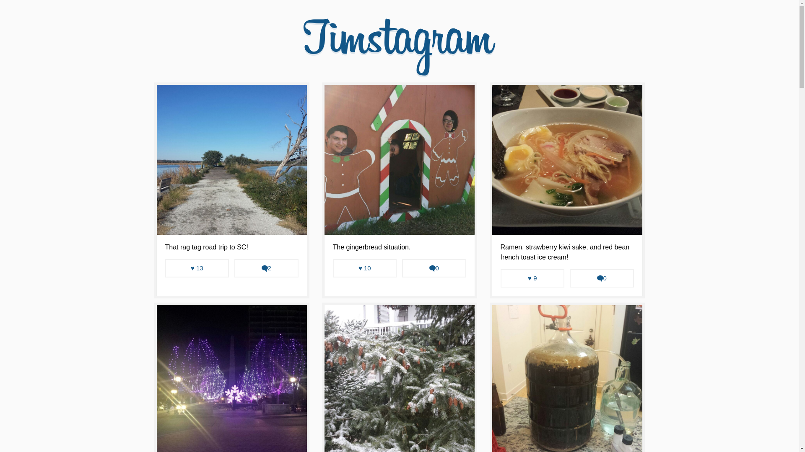

# 0025_timstagram

<figure><figcaption style=" text-align: center;">A spin off of Reduxstagram!</figcaption></figure>

# About Timstagram
Projects > ReactJS + Redux Instagram app from course (Wes Bos)
- Hello World! The Timstagram App was my div into using Redux with React. It also includes usage of React Router, React Transition Group, and other small imports.

- This is my first React/Redux app. I learned a great deal on the concepts on a single source of truth, immutability, and data structures! Hoping to build other exciting apps in the future with these technologies.

## Running

First `npm install` to grab all the necessary dependencies. 

Then run `npm start` and open <localhost:7770> in your browser.

## Production Build

Run `npm build` to create a distro folder and a bundle.js file.
